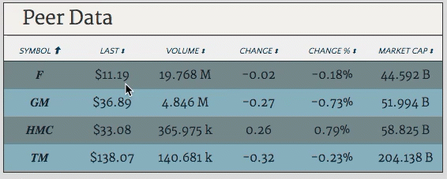

# [](http://www.blue-chip.sawatske.com/)

BlueChip is a single page web app where people can compete in online fantasy stock trading leagues.

### Technologies Utilized
  - React/Redux
  - Ruby on Rails
  - PostgreSQL
  - jQuery
  - CSS Grid

## **Features and Implementation**
The standout features of BlueChip include:
  1. Multiple subsequent AJAX calls to different servers
  1. Sortable Table with data formatting
  1. React components designed to be reused throughout the app
  1. Custom JSON objects returned from Rails backend to limit the number of required AJAX calls and to reduce the complexity of creating a normalized Redux State

### Subsequent AJAX calls
The asynchronous nature of fetching data from remote APIs can make the timing of updating your app's state tricky. The App must be aware of when the call is sent and when data from the call is received. In BlueChip, an additonal complexity arose given that there were two APIs from which data flowed into the Redux store.

Below is a quick sample of the type of Action Creators, both synchronous and asynchronous, used throughout the app. This example shows actions which initiate an AJAX call to the remote stock data API and indicate when that call is returned. Below that is show the thunk-based action used to delay the dispatch of `receiveStockSearch` action until the request to the remote API is complete.

```js
import * as RemoteStockAPIUtil from '../util/remote_api_util';

export const START_REMOTE_STOCK_FETCH = 'START_REMOTE_STOCK_FETCH';
export const RECEIVE_STOCK_SEARCH = 'RECEIVE_STOCK_SEARCH';
...

// sync action creators
export const receiveStockSearch = stockSeriesData => ({
  type: RECEIVE_STOCK_SEARCH,
  stockSeriesData
});

export const startStockRemoteFetch = () => ({
  type: START_REMOTE_STOCK_FETCH
});

// thunk async action creators
export const requestStockSearch = (symbol, dataTypes) => dispatch => {
  dispatch(startStockRemoteFetch());

  return RemoteStockAPIUtil.fetchStockSeries(symbol, dataTypes)
    .then(stockSeriesData => {
      dispatch(receiveStockSearch(stockSeriesData));
  });
}
```

### Sortable Table Feature
Tables are used quite frequently in BlueChip to display the large amount of data of varying types that exist within the app. I decided that a sortable table which can not only sort data, but can also display numerical data with appropriate symbols would be a great addition to the UI.

**Goal:** Build sortable table component that will sort and clearly display case independent strings, date objects and integers expressed as currency or percentages.


This is be accomplished with a `SortableTable` component to display the data and a `SortableHeader` container component containing an `onClick` event handler to trigger the sorting.

Read more about the Sortable Table feature [here](http://www.sawatske.com/blogs/1)


## Future Plans
- [ ] Full length blog posts covering each major feature
- [ ] `User#img_url` profile image uploading
- [ ] App wide ticker symbol component showing recent transactions, league creations, etc
